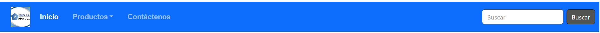
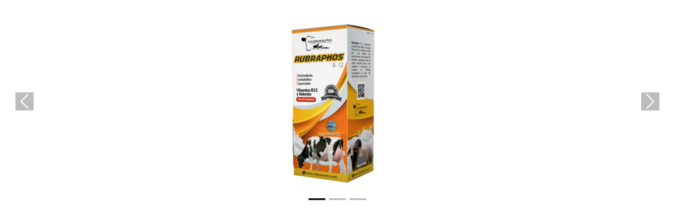
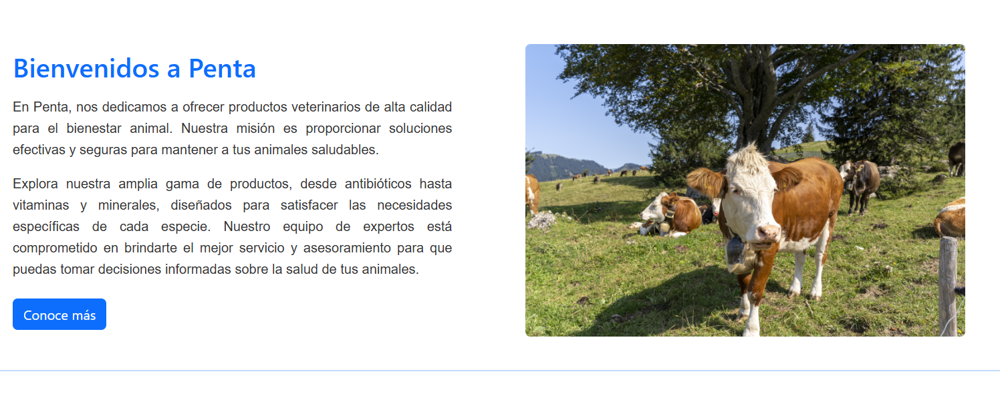
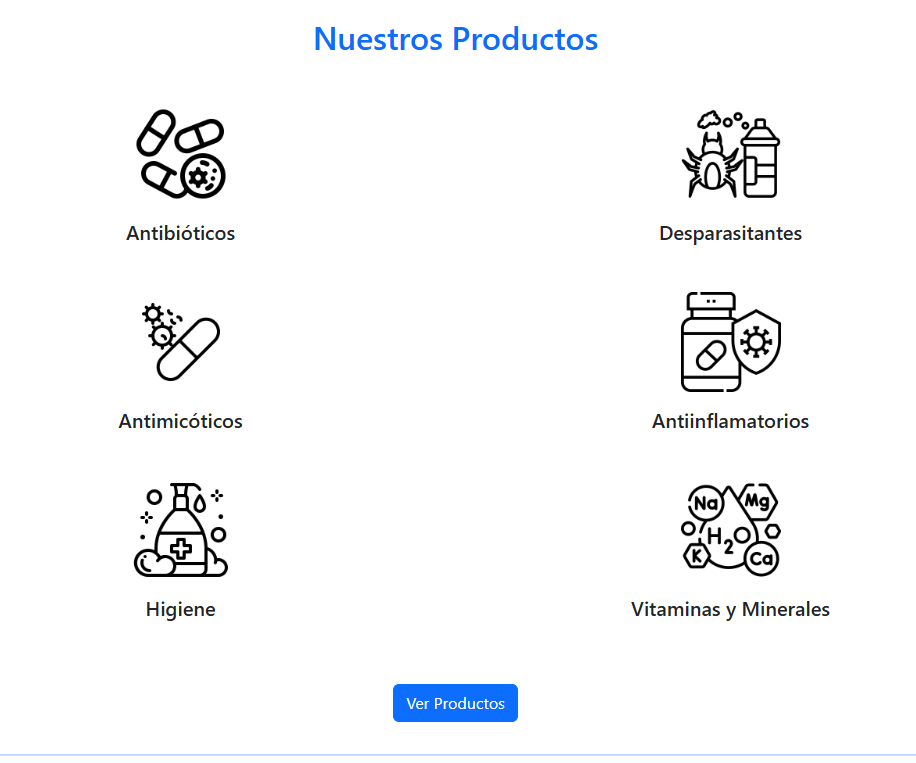
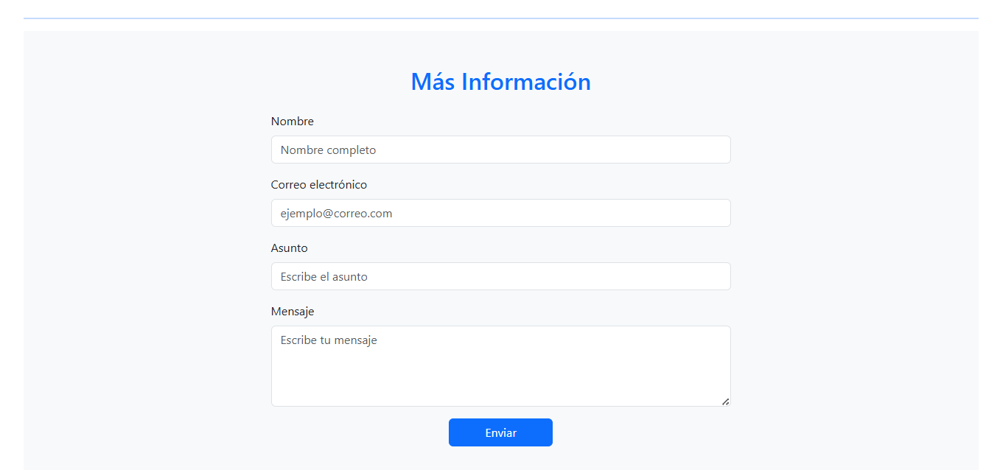
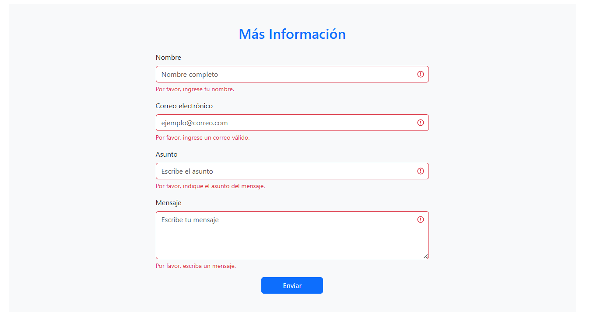
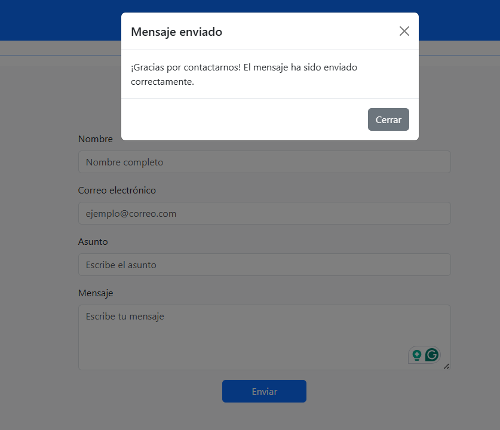
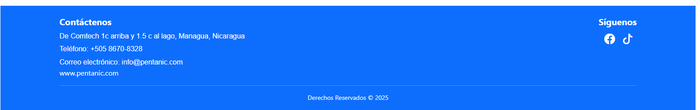

# Penta - Página Web para venta de productos veterinarios

## Descripción

El proyecto es una página web informativa para la empresa **Penta** dedicada a la distribución de productos veterinarios para el bienestar animal.  
El sitio fue desarrollado utilizando **HTML5**, **CSS** y **Bootstrap 5**, con un diseño adaptable.

El proyecto incluye:
- Una barra de navegación con logotipo y opciones incluyendo menú desplegable.  
- Carrusel de productos destacados con controles derecho e izquierdo y además indicadores para mostrar en qué imagen se encuentra.  
- Sección informativa sobre la empresa.  
- Catálogo visual de productos.  
- Formulario de contacto con validación y modal de confirmación.  
- Footer con información de contacto y redes sociales.

---

## Tecnologías utilizadas

- **HTML5**
- **CSS**
- **Bootstrap 5.3.8**
- **Bootstrap Icons**
- **JavaScript (para validación de formulario y modal)**

---

## Instalación y ejecución local

1. **Clonar el repositorio:**
   ```bash
   git clone https://github.com/shernandezr-u/Penta.git
   ```
   O utilizando GitKraken

   - Instalar GitKraken.
   - Abrir GitKraken.
   - Hacer click en File.
   - Seleccionar Clone Repo...
   - Seleccionar Clone with URL y pegar el URL https://github.com/shernandezr-u/Penta.git (Escoger la carpeta donde se va a guardar el proyecto localmente)
   - Hacer click en Clone the repo.

2. **Abrir el proyecto:**
   ```bash
   cd Penta
   ```

3. **Abrir el sitio web:**
   Utilizar **Live Server** en Visual Studio Code para ver los cambios en tiempo real.
   - Ir a extensiones en Visual Studio, buscar Live Server e instalar.
   - Una vez instalado, en el archivo HTML hacer click derecho y escoger la opción de Abrir con Live Server.
   - Se abre una pestaña en el navegador donde se ve la página web.


---

## Estructura del proyecto

```
penta/
│
├── index.html
├── css/
│   └── estilos.css
├── img/
│   ├── penta.png
│   ├── vaca.jpg
│   ├── antibioticos.png
│   ├── desparasitantes.png
│   ├── antimicotico.png
│   ├── antiinflamatorios.png
│   ├── higiene.png
│   ├── minerales.png
│   └── capturas/
│        ├── captura_bienvenida.png
│        ├── captura_carrusel.png  
│        ├── captura_formulario.png
│        ├── captura_modal.png
│        ├── captura_navbar.png
│        ├── captura_productos.png
│        └── captura_validacion.png
└── README.md
```

---

## Capturas del proyecto

### Barra de navegación


### Carrusel


### Bienvenida


### Sección de productos


### Formulario


### Validación


### Modal de confirmación de mensaje


### Footer


---